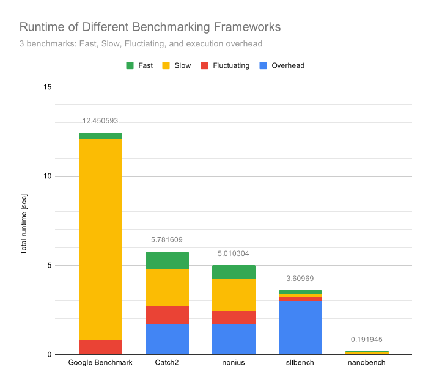
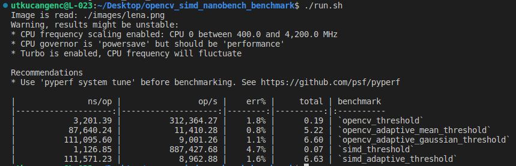

<a name="readme-top"></a>

<!-- PROJECT LOGO -->
<br />
<div align="center">
  <a href="https://github.com/utkucngnc/opencv_simd_nanobench_benchmark">
    
  </a>

<h3 align="center">OpenCV & SIMD nanobench Benchmark</h3>

  <p align="center">
    Comparative Benchmarking of Thresholding & Adaptive Thresholding Methods of OpenCV and SIMD Library using nanobench Micro-Benchmarking Module (LINUX ONLY)
    <br />
    <a href="https://github.com/utkucngnc/opencv_simd_nanobench_benchmark"><strong>Explore the docs »</strong></a>
    <br />
    <br />
    <a href="https://github.com/utkucngnc/opencv_simd_nanobench_benchmark">View Demo</a>
    ·
    <a href="https://github.com/utkucngnc/opencv_simd_nanobench_benchmark/issues">Report Bug</a>
    ·
    <a href="https://github.com/utkucngnc/opencv_simd_nanobench_benchmark/issues">Request Feature</a>
  </p>
</div>


<!-- TABLE OF CONTENTS -->
<details>
  <summary>Table of Contents</summary>
  <ol>
    <li>
      <a href="#about-the-project">About The Project</a>
      <ul>
        <li><a href="#built-with">Built With</a></li>
      </ul>
    </li>
    <li>
      <a href="#getting-started">Getting Started</a>
      <ul>
        <li><a href="#prerequisites">Prerequisites</a></li>
        <li><a href="#installation">Installation</a></li>
      </ul>
    </li>
    <li><a href="#usage">Usage</a></li>
    <li><a href="#license">License</a></li>
    <li><a href="#contact">Contact</a></li>
    <li><a href="#acknowledgments">Acknowledgments</a></li>
  </ol>
</details>


<!-- ABOUT THE PROJECT -->
## About The Project

The main goal of this project is to compare the binary thresholding and adaptive thresholding methods of the two image processing libraries, `open_cv` and `simd`, using `nanobench` micro-benchmarking framework.

Among other micro-benchmarking frameworks such as `benchmark` by Google, `nanobench` is preferred due to it' s superior speed and easy-to-use API. Additionally, it' s a header-only library.

<div align="center">
  <a href="https://nanobench.ankerl.com/comparison.html">
    
  </a>
</div>

<p align="right">(<a href="#readme-top">back to top</a>)</p>


### Built With

* [CMake](https://cmake.org/)
* [C++](https://cplusplus.com/)

<p align="right">(<a href="#readme-top">back to top</a>)</p>


<!-- GETTING STARTED -->
## Getting Started

In order to pull & use the repository, first check the prerequisites.

### Prerequisites

* Ubuntu 18.04.x and later.
* CMake ver. 3.13.x and later.
  ```sh
  cmake --version
  ```
* C++11 and later.
  ```sh
  gcc --v
  ```
* OpenCV 4.x.
  ```sh
  sudo updatedb
  cat $(locate OpenCVConfig.cmake) | grep "SET(OpenCV_VERSION "
  ```
* Simd
* nanobench

### Installation

1. To install the required packages, visit each link in Acknowledgements.
2. Download the repository, extract it and open the path in your IDE.
3. _If you don' t use VS Code, you may jump to Step 5._
  In order to solve the syntax completion problem, the directory of the `opencv` library must be updated. Type the following:
   ```sh
   cd /usr/local/include
   -ls
   ```
   You will see the content of your include folder. If there is a folder called `opencv4`, move the `opencv2` to your main include directory and delete the remaining empty fodler:
   ```sh
   sudo mv ./opencv4/opencv2 .
   sudo rm -rf opencv4
   -ls
   ```
   If the only `opencv` include directory is `opencv2`, you may proceed to _Step 4_.
4. Try to configure the project by running the `configure` script:
   ```sh
   path/to/repo/configure.sh
   ```
   You will get some path error by OpenCV because the path is changed. Go to the line where the error is thrown. Configure the line by deleting `opencv4/` part from there. Save the changes.
5. Configure the project by running the `configure` script:
   ```sh
   path/to/repo/configure.sh
   ```
6. Build the project by running the `build` script:
   ```sh
   path/to/repo/build.sh
   ```
7. Run the executable file by running the `run` script:
   ```sh
   path/to/repo/run.sh
   ```
   The iamge used in the benchmark is `lena` image. If you want to use an arbitrary image in an arbitrary path, open `run` script and change its content with the following:
   ```sh
   #! /bin/sh
   ./out/build/ocv_simd_nanobench $1
   ```
   Now the executable file can run with a user-prompt as following:
   ```sh
   path/to/repo/run.sh path_to_your_image.with_extension
   ```

<p align="right">(<a href="#readme-top">back to top</a>)</p>


<!-- USAGE EXAMPLES -->
## Usage

Below is the operation results of the 5 different built-in functions where the minimum number of iterations are limited to 5000 (_see the following [link](https://nanobench.ankerl.com/tutorial.html#something-unstable)_). The neighborhood (block size in OpenCV) and the shift in binarization (mean substraction constant in OpenCV) are selected as `7` and `2` respectively (_see the code for more detail_).

<div align="center">
  
</div>

<p align="right">(<a href="#readme-top">back to top</a>)</p>


<!-- LICENSE -->
## License

Distributed under the MIT License. See `LICENSE.txt` for more information.

<p align="right">(<a href="#readme-top">back to top</a>)</p>


<!-- CONTACT -->
## Contact

Project Link: [https://github.com/utkucngnc/opencv_simd_nanobench_benchmark](https://github.com/github_username/repo_name)

<p align="right">(<a href="#readme-top">back to top</a>)</p>


<!-- ACKNOWLEDGMENTS -->
## Acknowledgments

* nanobench [https://nanobench.ankerl.com/]()
* SIMD Library [https://ermig1979.github.io/Simd/]()
* OpenCV Documentation [https://docs.opencv.org/4.x/]()

<p align="right">(<a href="#readme-top">back to top</a>)</p>